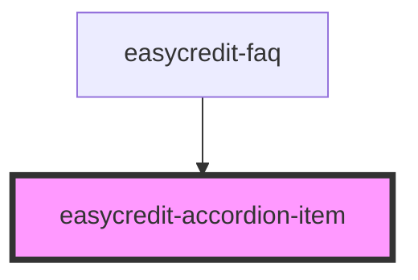

# easycredit-accordion-item

<!-- Auto Generated Below -->

## Properties

| Property                 | Attribute                  | Description                                                                      | Type                                        | Default                              |
| ------------------------ | -------------------------- | -------------------------------------------------------------------------------- | ------------------------------------------- | ------------------------------------ |
| `index`                  | `index`                    | index of accordion item from top to bottom                                       | `number`                                    | `-1`                                 |
| `mutationObserverConfig` | `mutation-observer-config` | The mutation observer config to listen for content changes in the accordion item | `{ childList: boolean; subtree: boolean; }` | `{ childList: true, subtree: true }` |
| `open`                   | `open`                     | accordion item is open or opening (css transition)                               | `boolean`                                   | `false`                              |

## Events

| Event            | Description                                              | Type               |
| ---------------- | -------------------------------------------------------- | ------------------ |
| `contentChanged` | triggered when the content of the accordion item changes | `CustomEvent<any>` |
| `openEvent`      | triggered when the accordion item is opened              | `CustomEvent<any>` |

## Methods

### `closeItem() => Promise<void>`

close the accordion item

#### Returns

Type: `Promise<void>`

### `openItem() => Promise<void>`

open the accordion item

#### Returns

Type: `Promise<void>`

## Dependencies

### Used by

 - [easycredit-faq](../easycredit-faq)

### Graph

----------------------------------------------

*Built with [StencilJS](https://stenciljs.com/)*
