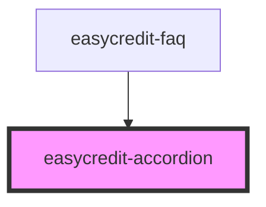

# easycredit-accordion

<!-- Auto Generated Below -->

## Methods

### `close(index: number) => Promise<void>`

close an accordion item

#### Parameters

| Name    | Type     | Description |
| ------- | -------- | ----------- |
| `index` | `number` |             |

#### Returns

Type: `Promise<void>`

### `open(index: number) => Promise<void>`

Open an accordion item

#### Parameters

| Name    | Type     | Description |
| ------- | -------- | ----------- |
| `index` | `number` |             |

#### Returns

Type: `Promise<void>`

## Dependencies

### Used by

 - [easycredit-faq](../easycredit-faq)

### Graph

----------------------------------------------

*Built with [StencilJS](https://stenciljs.com/)*
