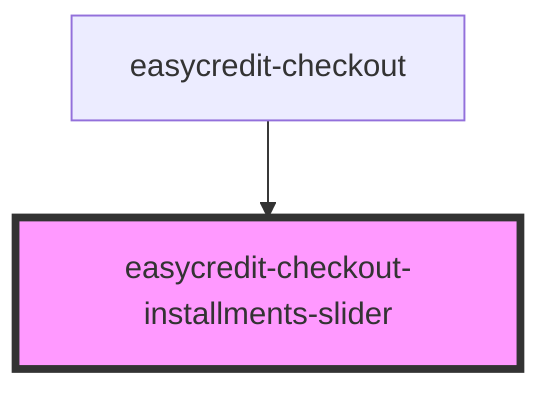

# easycredit-checkout-installments-slider

<!-- Auto Generated Below -->

## Properties

| Property       | Attribute      | Description | Type  | Default     |
| -------------- | -------------- | ----------- | ----- | ----------- |
| `installments` | `installments` |             | `any` | `undefined` |

## Events

| Event                 | Description | Type                  |
| --------------------- | ----------- | --------------------- |
| `selectedInstallment` |             | `CustomEvent<string>` |

## Dependencies

### Used by

 - [easycredit-checkout](../easycredit-checkout)

### Graph

----------------------------------------------

*Built with [StencilJS](https://stenciljs.com/)*
