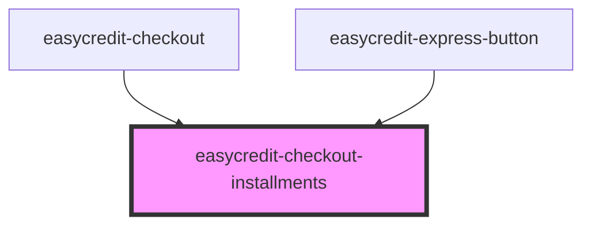

# easycredit-checkout-installments

<!-- Auto Generated Below -->

## Properties

| Property             | Attribute               | Description | Type     | Default                      |
| -------------------- | ----------------------- | ----------- | -------- | ---------------------------- |
| `installments`       | `installments`          |             | `any`    | `undefined`                  |
| `rows`               | `rows`                  |             | `number` | `5`                          |
| `showMoreButtonText` | `show-more-button-text` |             | `string` | `'Weitere Raten anzeigen +'` |

## Events

| Event                 | Description | Type                  |
| --------------------- | ----------- | --------------------- |
| `selectedInstallment` |             | `CustomEvent<string>` |

## Dependencies

### Used by

 - [easycredit-checkout](../easycredit-checkout)
 - [easycredit-express-button](../easycredit-express-button)

### Graph

----------------------------------------------

*Built with [StencilJS](https://stenciljs.com/)*
