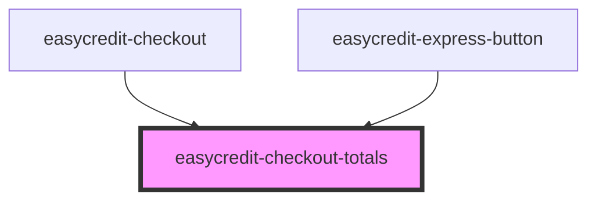

# easycredit-checkout-totals

<!-- Auto Generated Below -->

## Properties

| Property              | Attribute              | Description | Type               | Default     |
| --------------------- | ---------------------- | ----------- | ------------------ | ----------- |
| `amount`              | `amount`               |             | `number`           | `undefined` |
| `installmentPlans`    | `installment-plans`    |             | `InstallmentPlans` | `null`      |
| `selectedInstallment` | `selected-installment` |             | `InstallmentPlan`  | `null`      |

## Dependencies

### Used by

 - [easycredit-checkout](../easycredit-checkout)
 - [easycredit-express-button](../easycredit-express-button)

### Graph

----------------------------------------------

*Built with [StencilJS](https://stenciljs.com/)*
