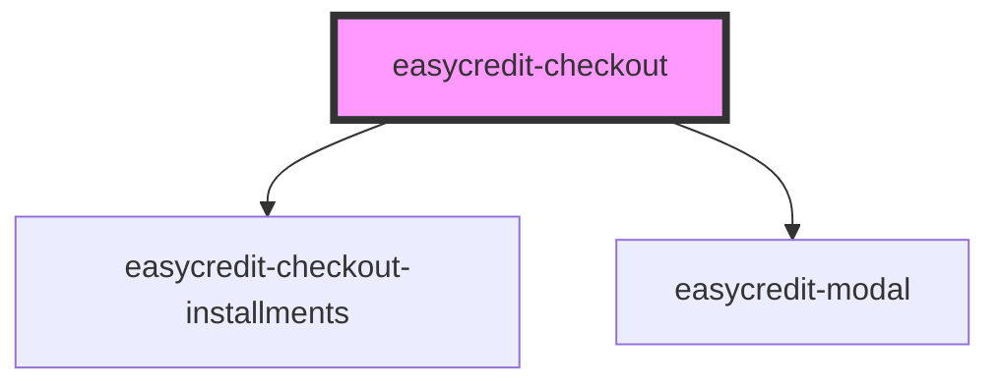

# easycredit-checkout

<!-- Auto Generated Below -->

## Properties

| Property           | Attribute           | Description                      | Type      | Default                       |
| ------------------ | ------------------- | -------------------------------- | --------- | ----------------------------- |
| `alert`            | `alert`             |                                  | `string`  | `undefined`                   |
| `amount`           | `amount`            |                                  | `number`  | `undefined`                   |
| `disableFlexprice` | `disable-flexprice` | Disable Flexprice in calculation | `boolean` | `false`                       |
| `isActive`         | `is-active`         |                                  | `boolean` | `true`                        |
| `method`           | `method`            |                                  | `string`  | `METHODS.INSTALLMENT_PAYMENT` |
| `paymentPlan`      | `payment-plan`      |                                  | `string`  | `undefined`                   |
| `webshopId`        | `webshop-id`        |                                  | `string`  | `undefined`                   |

## Dependencies

### Depends on

- [easycredit-checkout-installments](../easycredit-checkout-installments)
- [easycredit-modal](../easycredit-modal)

### Graph

----------------------------------------------

*Built with [StencilJS](https://stenciljs.com/)*
