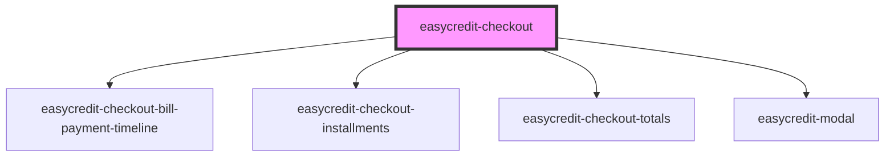

# easycredit-checkout

<!-- Auto Generated Below -->

## Properties

| Property           | Attribute           | Description                      | Type                                  | Default               |
| ------------------ | ------------------- | -------------------------------- | ------------------------------------- | --------------------- |
| `alert`            | `alert`             |                                  | `string`                              | `undefined`           |
| `amount`           | `amount`            |                                  | `number`                              | `undefined`           |
| `disableFlexprice` | `disable-flexprice` | Disable Flexprice in calculation | `boolean`                             | `false`               |
| `isActive`         | `is-active`         |                                  | `boolean`                             | `true`                |
| `paymentPlan`      | `payment-plan`      | Payment Plan is set as property  | `string`                              | `undefined`           |
| `paymentType`      | `payment-type`      |                                  | `METHODS.BILL \| METHODS.INSTALLMENT` | `METHODS.INSTALLMENT` |
| `webshopId`        | `webshop-id`        |                                  | `string`                              | `undefined`           |

## Dependencies

### Depends on

- [easycredit-checkout-bill-payment-timeline](../easycredit-checkout-bill-payment-timeline)
- [easycredit-checkout-installments](../easycredit-checkout-installments)
- [easycredit-checkout-totals](../easycredit-checkout-totals)
- [easycredit-modal](../easycredit-modal)

### Graph

----------------------------------------------

*Built with [StencilJS](https://stenciljs.com/)*
