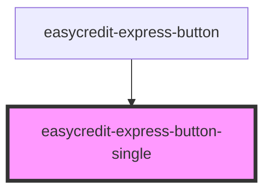

# easycredit-express-button

<!-- Auto Generated Below -->

## Properties

| Property      | Attribute      | Description | Type                                  | Default               |
| ------------- | -------------- | ----------- | ------------------------------------- | --------------------- |
| `alert`       | `alert`        |             | `string`                              | `undefined`           |
| `amount`      | `amount`       |             | `number`                              | `undefined`           |
| `bgBlue`      | `bg-blue`      |             | `boolean`                             | `false`               |
| `fullWidth`   | `full-width`   |             | `boolean`                             | `false`               |
| `paymentType` | `payment-type` |             | `METHODS.BILL \| METHODS.INSTALLMENT` | `METHODS.INSTALLMENT` |
| `webshopId`   | `webshop-id`   |             | `string`                              | `undefined`           |

## Events

| Event           | Description | Type                  |
| --------------- | ----------- | --------------------- |
| `buttonClicked` |             | `CustomEvent<string>` |

## Dependencies

### Used by

 - [easycredit-express-button](../easycredit-express-button)

### Graph

----------------------------------------------

*Built with [StencilJS](https://stenciljs.com/)*
