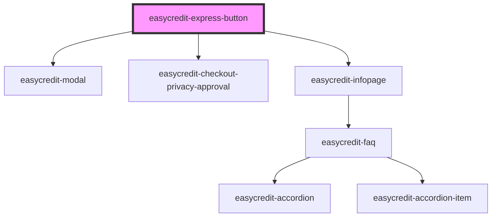

# easycredit-express-button

<!-- Auto Generated Below -->

## Properties

| Property      | Attribute      | Description | Type      | Default     |
| ------------- | -------------- | ----------- | --------- | ----------- |
| `alert`       | `alert`        |             | `string`  | `undefined` |
| `amount`      | `amount`       |             | `number`  | `0`         |
| `bgBlue`      | `bg-blue`      |             | `boolean` | `false`     |
| `fullWidth`   | `full-width`   |             | `boolean` | `false`     |
| `redirectUrl` | `redirect-url` |             | `string`  | `undefined` |
| `webshopId`   | `webshop-id`   |             | `string`  | `undefined` |

## Dependencies

### Depends on

- [easycredit-modal](../easycredit-modal)
- [easycredit-checkout-privacy-approval](../easycredit-checkout-privacy-approval)
- [easycredit-infopage](../easycredit-infopage)

### Graph

----------------------------------------------

*Built with [StencilJS](https://stenciljs.com/)*
