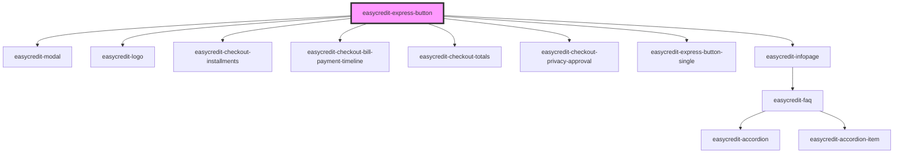

# easycredit-express-button-set

<!-- Auto Generated Below -->

## Properties

| Property       | Attribute       | Description | Type      | Default     |
| -------------- | --------------- | ----------- | --------- | ----------- |
| `amount`       | `amount`        |             | `number`  | `undefined` |
| `fullWidth`    | `full-width`    |             | `boolean` | `false`     |
| `paymentTypes` | `payment-types` |             | `string`  | `undefined` |
| `redirectUrl`  | `redirect-url`  |             | `string`  | `undefined` |
| `webshopId`    | `webshop-id`    |             | `string`  | `undefined` |

## Dependencies

### Depends on

- [easycredit-modal](../easycredit-modal)
- [easycredit-logo](../easycredit-logo)
- [easycredit-checkout-installments](../easycredit-checkout-installments)
- [easycredit-checkout-bill-payment-timeline](../easycredit-checkout-bill-payment-timeline)
- [easycredit-checkout-totals](../easycredit-checkout-totals)
- [easycredit-checkout-privacy-approval](../easycredit-checkout-privacy-approval)
- [easycredit-express-button-single](../easycredit-express-button-single)
- [easycredit-infopage](../easycredit-infopage)

### Graph

----------------------------------------------

*Built with [StencilJS](https://stenciljs.com/)*
