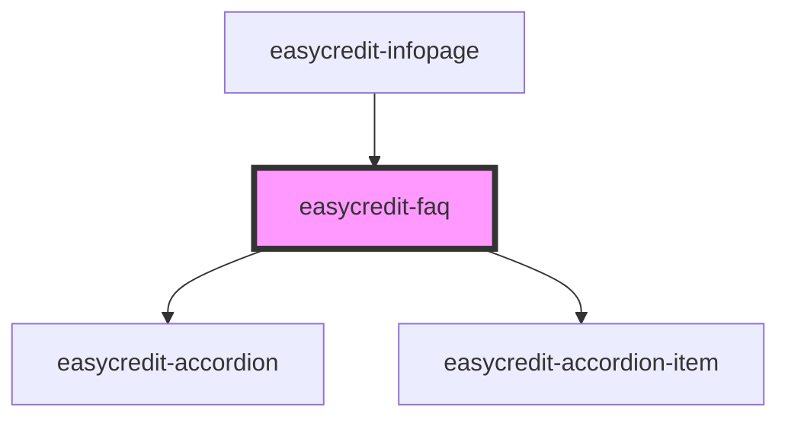

# easycredit-faq

<!-- Auto Generated Below -->

## Properties

| Property      | Attribute      | Description | Type     | Default               |
| ------------- | -------------- | ----------- | -------- | --------------------- |
| `paymentType` | `payment-type` |             | `string` | `METHODS.INSTALLMENT` |

## Dependencies

### Used by

 - [easycredit-infopage](../easycredit-infopage)

### Depends on

- [easycredit-accordion](../easycredit-accordion)
- [easycredit-accordion-item](../easycredit-accordion-item)

### Graph

----------------------------------------------

*Built with [StencilJS](https://stenciljs.com/)*
