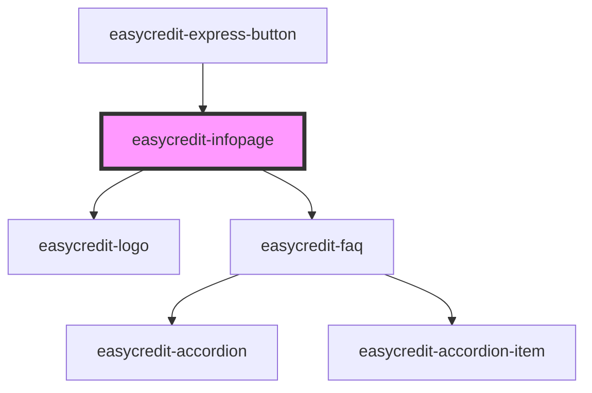

# easycredit-infopage

<!-- Auto Generated Below -->

## Properties

| Property       | Attribute       | Description | Type                      | Default     |
| -------------- | --------------- | ----------- | ------------------------- | ----------- |
| `paymentTypes` | `payment-types` |             | `string`                  | `undefined` |
| `variant`      | `variant`       |             | `"default" \| "enhanced"` | `'default'` |

## Dependencies

### Used by

 - [easycredit-express-button](../easycredit-express-button)

### Depends on

- [easycredit-logo](../easycredit-logo)
- [easycredit-faq](../easycredit-faq)

### Graph

----------------------------------------------

*Built with [StencilJS](https://stenciljs.com/)*
