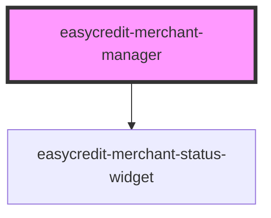

# easycredit-merchant-manager

<!-- Auto Generated Below -->

## Properties

| Property | Attribute | Description | Type     | Default     |
| -------- | --------- | ----------- | -------- | ----------- |
| `date`   | `date`    |             | `string` | `undefined` |
| `txId`   | `tx-id`   |             | `string` | `undefined` |

## Dependencies

### Depends on

- [easycredit-merchant-status-widget](../easycredit-merchant-status-widget)

### Graph

----------------------------------------------

*Built with [StencilJS](https://stenciljs.com/)*
