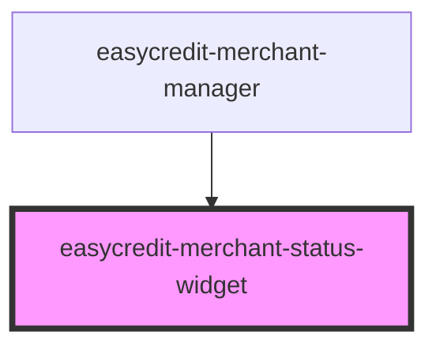

# easycredit-merchant-status-widget

<!-- Auto Generated Below -->

## Properties

| Property    | Attribute    | Description | Type      | Default     |
| ----------- | ------------ | ----------- | --------- | ----------- |
| `date`      | `date`       |             | `string`  | `undefined` |
| `isManager` | `is-manager` |             | `boolean` | `undefined` |
| `txId`      | `tx-id`      |             | `string`  | `undefined` |

## Dependencies

### Used by

 - [easycredit-merchant-manager](../easycredit-merchant-manager)

### Graph

----------------------------------------------

*Built with [StencilJS](https://stenciljs.com/)*
