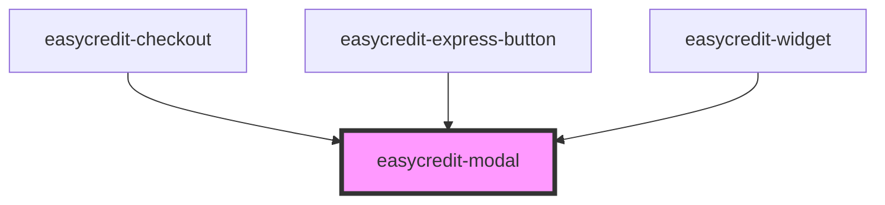

# easycredit-modal

<!-- Auto Generated Below -->

## Properties

| Property         | Attribute         | Description | Type      | Default        |
| ---------------- | ----------------- | ----------- | --------- | -------------- |
| `isOpen`         | `is-open`         |             | `boolean` | `false`        |
| `loading`        | `loading`         |             | `boolean` | `false`        |
| `loadingMessage` | `loading-message` |             | `string`  | `'Loading...'` |
| `show`           | `show`            |             | `boolean` | `undefined`    |
| `size`           | `size`            |             | `string`  | `''`           |

## Events

| Event         | Description | Type               |
| ------------- | ----------- | ------------------ |
| `modalClosed` |             | `CustomEvent<any>` |
| `modalOpened` |             | `CustomEvent<any>` |
| `modalSubmit` |             | `CustomEvent<any>` |

## Methods

### `close() => Promise<void>`

#### Returns

Type: `Promise<void>`

### `open() => Promise<void>`

#### Returns

Type: `Promise<void>`

### `submit() => Promise<void>`

#### Returns

Type: `Promise<void>`

### `toggle() => Promise<void>`

#### Returns

Type: `Promise<void>`

## Shadow Parts

| Part       | Description |
| ---------- | ----------- |
| `"submit"` |             |

## Dependencies

### Used by

 - [easycredit-checkout](../easycredit-checkout)
 - [easycredit-express-button](../easycredit-express-button)
 - [easycredit-widget](../easycredit-widget)

### Graph

----------------------------------------------

*Built with [StencilJS](https://stenciljs.com/)*
