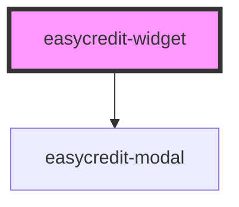

# my-component

<!-- Auto Generated Below -->

## Properties

| Property           | Attribute           | Description | Type      | Default              |
| ------------------ | ------------------- | ----------- | --------- | -------------------- |
| `amount`           | `amount`            |             | `number`  | `undefined`          |
| `disableFlexprice` | `disable-flexprice` |             | `boolean` | `false`              |
| `displayType`      | `display-type`      |             | `string`  | `undefined`          |
| `extended`         | `extended`          |             | `boolean` | `true`               |
| `paymentTypes`     | `payment-types`     |             | `string`  | `'BILL,INSTALLMENT'` |
| `webshopId`        | `webshop-id`        |             | `string`  | `undefined`          |

## Dependencies

### Depends on

- [easycredit-modal](../easycredit-modal)

### Graph

----------------------------------------------

*Built with [StencilJS](https://stenciljs.com/)*
