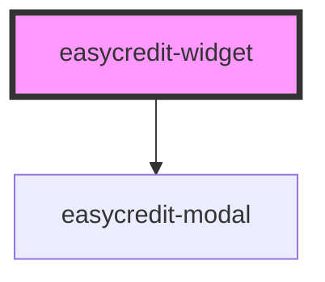

# my-component

<!-- Auto Generated Below -->

## Properties

| Property    | Attribute    | Description          | Type      | Default     |
| ----------- | ------------ | -------------------- | --------- | ----------- |
| `amount`    | `amount`     | Financing Amount     | `number`  | `undefined` |
| `extended`  | `extended`   | Show if out of range | `boolean` | `true`      |
| `webshopId` | `webshop-id` | Webshop Id           | `string`  | `undefined` |

## Dependencies

### Depends on

- [easycredit-modal](../easycredit-modal)

### Graph

----------------------------------------------

*Built with [StencilJS](https://stenciljs.com/)*
